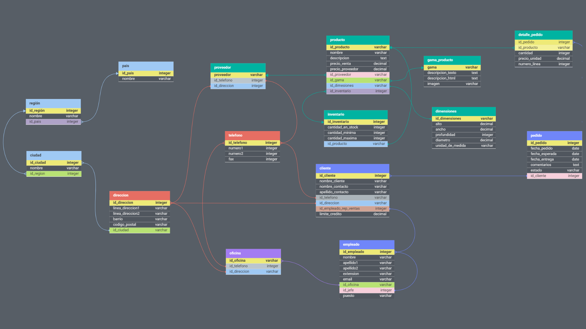

DDL

Creacion de la base de datos:

```mysql

mysql> CREATE DATABASE normalizacion;
Query OK, 1 row affected (0.04 sec)

mysql> SHOW DATABASES;
+--------------------+
| Database           |
+--------------------+
| information_schema |
| mysql              |
| normalizacion      |
| performance_schema |
| sys                |
| work               |
+--------------------+
6 rows in set (0.00 sec)
```

Creacion de las tablas:

```mysql

CREATE TABLE pais(
    id_pais INT(11) NOT NULL AUTO_INCREMENT,
    PRIMARY KEY(id_pais),
    nombre VARCHAR(100) NOT NULL
    );

CREATE TABLE region(
    id_region INT(11) NOT NULL AUTO_INCREMENT,
    PRIMARY KEY(id_region),
    nombre VARCHAR(100) NOT NULL,
    id_pais INT(11) NOT NULL,
    CONSTRAINT FK_region_pais FOREIGN KEY (id_pais) REFER
ENCES pais(id_pais));

CREATE TABLE ciudad(
    id_ciudad INT(11) NOT NULL AUTO_INCREMENT,
    PRIMARY KEY(id_ciudad),
    nombre VARCHAR(100) NOT NULL,
    id_region INT(11) NOT NULL,
    CONSTRAINT FK_ciudad_region FOREIGN KEY (id_region) REFERENCES region(id_region)
);

CREATE TABLE direccion(
    id_direccion INT(11) NOT NULL AUTO_INCREMENT,
    linea_direccion1 VARCHAR(50) NOT NULL,
    linea_direccion2 VARCHAR(50),
    barrio VARCHAR(100) NOT NULL,
    codigo_postal VARCHAR(10),
    id_ciudad INT(11) NOT NULL,
    PRIMARY KEY(id_direccion),
    CONSTRAINT FK_direccion_ciudad FOREIGN KEY(id_ciudad) REFERENCES ciudad(id_ciudad)
);

CREATE TABLE proveedor (
    id_proveedor INT(11) NOT NULL,
    PRIMARY KEY (id_proveedor),
    telefono VARCHAR(20) NOT NULL,
    nombre VARCHAR(100) NOT NULL
);

CREATE TABLE proveedor_direccion (
    id_proveedor INT(11) NOT NULL,
    id_direccion INT(11) NOT NULL,
    PRIMARY KEY (id_proveedor, id_direccion),
    FOREIGN KEY (id_proveedor) REFERENCES proveedor(id_proveedor),
    FOREIGN KEY (id_direccion) REFERENCES direccion(id_direccion)
);

CREATE TABLE oficina (
    id_oficina INT(11) NOT NULL AUTO_INCREMENT,
    nombre VARCHAR(100) NOT NULL,
    telefono VARCHAR(20),
    PRIMARY KEY (id_oficina)
);

CREATE TABLE oficina_direccion (
    id_oficina INT(11) NOT NULL,
    id_direccion INT(11) NOT NULL,
    PRIMARY KEY (id_oficina, id_direccion),
    FOREIGN KEY (id_oficina) REFERENCES oficina(id_oficina),
    FOREIGN KEY (id_direccion) REFERENCES direccion(id_direccion)
);

CREATE TABLE gama_producto(
    gama VARCHAR(50),
    PRIMARY KEY (gama),
    descripcion_texto TEXT,
    descripcion_html TEXT,
    imagen VARCHAR(256));

CREATE TABLE dimensiones(
    id_dimensiones INT(11) NOT NULL AUTO_INCREMENT,
    PRIMARY KEY (id_dimensiones),
    alto DECIMAL(5),
    ancho DECIMAL(5),
    profundidad INT(5),
    diametro DECIMAL(5),
    unidad_de_medida VARCHAR(10));

CREATE TABLE producto (
    id_producto INT(11) NOT NULL AUTO_INCREMENT,
    PRIMARY KEY (id_producto),
    nombre VARCHAR(100) NOT NULL,
    descripcion TEXT,
    precio_proveedor DECIMAL (12,5),
    precio_venta DECIMAL(12,5) NOT NULL,
    id_dimensiones INT(11),
    FOREIGN KEY (id_dimensiones) REFERENCES dimensiones(id_dimensiones),
    id_proveedor INT(11),
    FOREIGN KEY (id_proveedor) REFERENCES proveedor(id_proveedor),
    gama VARCHAR(50) NOT NULL,
    FOREIGN KEY (gama) REFERENCES gama_producto(gama)
);

CREATE TABLE inventario (
    id_inventario INT(11) NOT NULL AUTO_INCREMENT,
    id_producto INT(11) NOT NULL,
    cantidad_en_stock SMALLINT(6) NOT NULL,
    ubicacion VARCHAR(100), 
    PRIMARY KEY (id_inventario),
    FOREIGN KEY (id_producto) REFERENCES producto(id_producto)
);

CREATE TABLE empleado (
    id_empleado INT(11) NOT NULL,
    PRIMARY KEY (id_empleado),
    nombre VARCHAR(50) NOT NULL,
    apellido1 VARCHAR(50) NOT NULL,
    apellido2 VARCHAR(50) NOT NULL,
    extension VARCHAR(10) NOT NULL,
    email VARCHAR(100) NOT NULL,
    id_oficina INT(11) NOT NULL,
    CONSTRAINT FK_empleado_oficina FOREIGN KEY (id_oficina) REFERENCES 	 
    oficina(id_oficina),
    id_jefe INT(11),
    CONSTRAINT FK_empleado_jefe FOREIGN KEY (id_jefe) REFERENCES 
    empleado(id_empleado),
    puesto VARCHAR(50)
);

CREATE TABLE cliente (
    id_cliente INT(11) NOT NULL,
    nombre_cliente VARCHAR(50) NOT NULL,
    telefono VARCHAR(20),
    id_empleado_rep_ventas INT(11),
    limite_credito DECIMAL(15),
    PRIMARY KEY (id_cliente),
    CONSTRAINT FK_cliente_empleado_rep_ventas FOREIGN KEY 
    (id_empleado_rep_ventas) REFERENCES empleado(id_empleado)
);

CREATE TABLE cliente_direccion (
    id_cliente INT(11) NOT NULL,
    id_direccion INT(11) NOT NULL,
    PRIMARY KEY (id_cliente, id_direccion),
    FOREIGN KEY (id_cliente) REFERENCES cliente(id_cliente),
    FOREIGN KEY (id_direccion) REFERENCES direccion(id_direccion)
);

CREATE TABLE cliente_direccion (
    id_cliente INT(11) NOT NULL,
    id_direccion INT(11) NOT NULL,
    PRIMARY KEY (id_cliente, id_direccion),
    FOREIGN KEY (id_cliente) REFERENCES cliente(id_cliente),
    FOREIGN KEY (id_direccion) REFERENCES direccion(id_direccion)
);

CREATE TABLE contacto (
    id_contacto INT(11) NOT NULL AUTO_INCREMENT,
    nombre_contacto VARCHAR(30) NOT NULL,
    apellido_contacto VARCHAR(30) NOT NULL,
    id_cliente INT(11) NOT NULL,
    PRIMARY KEY (id_contacto),
    FOREIGN KEY (id_cliente) REFERENCES cliente(id_cliente)
);

CREATE TABLE pedido (
    id_pedido INT(11) NOT NULL AUTO_INCREMENT,
    PRIMARY KEY(id_pedido),
    fecha_pedido DATE NOT NULL,
    fecha_esperada DATE NOT NULL,
    fecha_entrega DATE,
    estado VARCHAR(15) NOT NULL,
    comentarios TEXT,
    id_cliente INT(11) NOT NULL,
    CONSTRAINT FK_pedido_cliente FOREIGN KEY (id_cliente) REFERENCES cliente(id_cliente)
);

CREATE TABLE detalle_pedido (
    id_pedido INT(11) NOT NULL,
    id_producto INT(11) NOT NULL,
    PRIMARY KEY (id_pedido, id_producto),
    cantidad INT(11),
    precio_unidad DECIMAL(15,2),
    numero_linea SMALLINT(6),
    FOREIGN KEY (id_pedido) REFERENCES pedido(id_pedido),
    FOREIGN KEY (id_producto) REFERENCES producto(id_producto)
);

CREATE TABLE pago(
id_transaccion VARCHAR(50) NOT NULL,
PRIMARY KEY (id_transaccion),
id_cliente INT(11) NOT NULL,
forma_pago VARCHAR(40) NOT NULL,
fecha_pago DATE NOT NULL,
total DECIMAL(15) NOT NULL,
CONSTRAINT FK_pago_cliente FOREIGN KEY (id_cliente) REFERENCES cliente(id_cliente)
);


```


**DML**

**INSERT**

```mysql

-- Países

INSERT INTO pais (nombre) 
VALUES 
    ('Estados Unidos'),
    ('Canadá'),
    ('México'),
    ('Brasil'),
    ('Argentina'),
    ('España'),
    ('Francia');


-- Regiones

INSERT INTO region (nombre, id_pais)
VALUES 
    ('Nueva Inglaterra', 1),
    ('Quebec', 2),            
    ('Distrito Federal', 3),  
    ('São Paulo', 4),         
    ('Buenos Aires', 5),      
    ('Comunidad de Madrid', 6),
    ('Île-de-France', 7);     

-- Ciudades

INSERT INTO ciudad (nombre, id_region)
VALUES 
    ('Boston', 1),              
    ('Montreal', 2),            
    ('Ciudad de México', 3),    
    ('São Paulo', 4),           
    ('Buenos Aires', 5),        
    ('Madrid', 6),              
    ('París', 7);


-- Oficinas

INSERT INTO oficina (nombre, telefono)
VALUES 
    ('Oficina Central', '123-456-7890'),
    ('Sucursal Norte', '987-654-3210'),
    ('Sucursal Sur', '234-567-8901'),
    ('Sucursal Este', '345-678-9012'),
    ('Sucursal Oeste', '456-789-0123'),
    ('Oficina Principal', '567-890-1234'),
    ('Oficina Regional', '678-901-2345');


-- direccion

INSERT INTO direccion (linea_direccion1, linea_direccion2, barrio, codigo_postal, id_ciudad)
VALUES 
    ('123 Main Street', NULL, 'Downtown', '02101', 1),     -- Boston
    ('456 Rue Principale', NULL, 'Centre-ville', 'H1A 1A1', 2),  -- Montreal
    ('789 Avenida Principal', 'Colonia Centro', 'Centro', '01000', 3), -- Ciudad de México
    ('123 Avenida Paulista', 'Apartamento 101', 'Jardins', '01234-567', 4), -- São Paulo
    ('456 Calle Principal', NULL, 'Centro', '1000', 5),    -- Buenos Aires
    ('789 Calle Principal', NULL, 'Centro', '28001', 6),   -- Madrid
    ('123 Rue Principale', NULL, 'Centre-ville', '75001', 7);   -- París

-- proveedores

INSERT INTO proveedor (id_proveedor, telefono, nombre) VALUES
(123456789, '1234567890', 'Juan Perez'),
(987654321, '0987654321', 'Maria Garcia'),
(234567890, '2345678901', 'Luis Rodriguez'),
(345678901, '3456789012', 'Ana Martinez'),
(456789012, '4567890123', 'Pedro Sanchez'),
(567890123, '5678901234', 'Laura Gonzalez'),
(678901234, '6789012345', 'Carlos Lopez');


-- Proveedores_direccion

-- Juan Perez - Boston, Estados Unidos
INSERT INTO proveedor_direccion (id_proveedor, id_direccion)
VALUES (123456789, 1);

-- Maria Garcia - Montreal, Canadá
INSERT INTO proveedor_direccion (id_proveedor, id_direccion)
VALUES (987654321, 2);

-- Luis Rodriguez - Ciudad de México, México
INSERT INTO proveedor_direccion (id_proveedor, id_direccion)
VALUES (234567890, 3);

-- Ana Martinez - São Paulo, Brasil
INSERT INTO proveedor_direccion (id_proveedor, id_direccion)
VALUES (345678901, 4);

-- Pedro Sanchez - Buenos Aires, Argentina
INSERT INTO proveedor_direccion (id_proveedor, id_direccion)
VALUES (456789012, 5);

-- Laura Gonzalez - Madrid, España
INSERT INTO proveedor_direccion (id_proveedor, id_direccion)
VALUES (567890123, 6);

-- Carlos Lopez - París, Francia
INSERT INTO proveedor_direccion (id_proveedor, id_direccion)
VALUES (678901234, 7);

-- oficinas

INSERT INTO oficina (nombre, telefono)
VALUES 
    ('Oficina Central', '123-456-7890'),
    ('Sucursal Norte', '987-654-3210'),
    ('Sucursal Sur', '234-567-8901'),
    ('Sucursal Este', '345-678-9012'),
    ('Sucursal Oeste', '456-789-0123'),
    ('Oficina Principal', '567-890-1234'),
    ('Oficina Regional', '678-901-2345');

-- oficina_direccion

INSERT INTO oficina_direccion (id_oficina, id_direccion)
VALUES 
    (1, 1), -- Oficina Central - Boston, Estados Unidos
    (2, 2), -- Sucursal Norte - Montreal, Canadá
    (3, 3), -- Sucursal Sur - Ciudad de México, México
    (4, 4), -- Sucursal Este - São Paulo, Brasil
    (5, 5), -- Sucursal Oeste - Buenos Aires, Argentina
    (6, 6), -- Oficina Principal - Madrid, España
    (7, 7); -- Oficina Regional - París, Francia


-- gama_producto

INSERT INTO gama_producto (gama, descripcion_texto, descripcion_html, imagen)
VALUES 
    ('Gama Alta', 'Productos de alta calidad con características premium.', '<p>Productos de alta calidad con características premium.</p>', 'imagen_gama_alta.jpg'),
    ('Gama Media', 'Productos de calidad aceptable a precios accesibles.', '<p>Productos de calidad aceptable a precios accesibles.</p>', 'imagen_gama_media.jpg'),
    ('Gama Baja', 'Productos económicos para presupuestos ajustados.', '<p>Productos económicos para presupuestos ajustados.</p>', 'imagen_gama_baja.jpg');

-- dimensiones

INSERT INTO dimensiones (alto, ancho, profundidad, diametro, unidad_de_medida)
VALUES 
    (10.5, 5.3, 8, NULL, 'cm'),
    (20, 15, 12, NULL, 'cm'),
    (30, 25, 20, NULL, 'cm'),
    (8, 8, 8, NULL, 'in'),
    (12.5, 10, 5, NULL, 'in'),
    (18, 12, 10, NULL, 'in');


-- prodcuto

INSERT INTO producto (nombre, descripcion, precio_proveedor, precio_venta, id_dimensiones, id_proveedor, gama)
VALUES 
    ('Laptop HP', 'Portátil de alta calidad con procesador rápido y pantalla de alta resolución.', 800.00, 1200.00, 1, 123456789, 'Gama Alta'),
    ('Teléfono Samsung', 'Teléfono inteligente con cámara de alta resolución y pantalla táctil.', 500.00, 700.00, 2, 987654321, 'Gama Media'),
    ('Tablet Lenovo', 'Tablet compacta con sistema operativo Android y larga duración de batería.', 250.00, 350.00, 3, 234567890, 'Gama Baja'),
    ('TV LG', 'Televisor LED de 55 pulgadas con resolución 4K y sonido envolvente.', 1200.00, 1500.00, 4, 345678901, 'Gama Alta'),
    ('Refrigerador Whirlpool', 'Refrigerador con dispensador de agua y congelador de gran capacidad.', 1000.00, 1300.00, 5, 456789012, 'Gama Media'),
    ('Licuadora Oster', 'Licuadora de alto rendimiento con múltiples velocidades y jarra de vidrio.', 50.00, 80.00, 6, 567890123, 'Gama Baja');


-- inventario

INSERT INTO inventario (id_producto, cantidad_en_stock, ubicacion)
VALUES 
    (1, 20, 'Pasillo A, Estante 1'),
    (2, 15, 'Pasillo B, Estante 2'),
    (3, 30, 'Pasillo C, Estante 3'),
    (4, 10, 'Pasillo D, Estante 4'),
    (5, 25, 'Pasillo E, Estante 5'),
    (6, 40, 'Pasillo F, Estante 6');

-- empleados

INSERT INTO empleado (id_empleado, nombre, apellido1, apellido2, extension, email, id_oficina, id_jefe, puesto)
VALUES 
    (1234567890, 'Juan', 'García', 'Pérez', '1234', 'juan.garcia@example.com', 1, NULL, 'Gerente'),
    (2345678901, 'María', 'Martínez', 'López', '5678', 'maria.martinez@example.com', 2, 1234567890, 'Asistente'),
    (3456789012, 'Pedro', 'Hernández', 'Gómez', '9012', 'pedro.hernandez@example.com', 1, 1234567890, 'Asistente'),
    (4567890123, 'Laura', 'Díaz', 'Rodríguez', '3456', 'laura.diaz@example.com', 3, 1234567890, 'Secretaria');


-- clientes

INSERT INTO cliente (id_cliente, nombre_cliente, telefono, id_empleado_rep_ventas, limite_credito)
VALUES 
    (122334455, 'Carlos Pérez', '123-456-7890', 1, 5000.00),
    (223344566, 'Ana García', '234-567-8901', 2, 7000.00),
    (334455677, 'Pedro Martínez', '345-678-9012', 3, 10000.00),
    (445567788, 'María Rodríguez', '456-789-0123', 4, 8000.00),
    (556678899, 'Laura López', '567-890-1234', 1, 6000.00),
    (667889900, 'Juan Hernández', '678-901-2345', 2, 9000.00),
    (778990011, 'Sofía Díaz', '789-012-3456', 3, 12000.00),
    (899001122, 'Miguel Torres', '890-123-4567', 4, 8500.00);


-- Cliente_direccion

INSERT INTO cliente_direccion (id_cliente, id_direccion)
VALUES 
    (122334455, 1), -- Cliente Carlos Pérez - Dirección en Boston
    (223344566, 2), -- Cliente Ana García - Dirección en Montreal
    (334455677, 3), -- Cliente Pedro Martínez - Dirección en Ciudad de México
    (445567788, 4), -- Cliente María Rodríguez - Dirección en São Paulo
    (556678899, 5), -- Cliente Laura López - Dirección en Buenos Aires
    (667889900, 6), -- Cliente Juan Hernández - Dirección en Madrid
    (778990011, 7), -- Cliente Sofía Díaz - Dirección en París
    (899001122, 1); -- Cliente Miguel Torres - Dirección en Boston (misma que Carlos Pérez)


-- contactos

INSERT INTO contacto (nombre_contacto, apellido_contacto, id_cliente)
VALUES 
    ('Juan', 'López', 122334455), -- Contacto para el cliente Carlos Pérez
    ('María', 'Gómez', 223344566), -- Contacto para el cliente Ana García
    ('Pedro', 'Díaz', 334455677), -- Contacto para el cliente Pedro Martínez
    ('Laura', 'Martínez', 445567788), -- Contacto para el cliente María Rodríguez
    ('Sofía', 'Pérez', 556678899), -- Contacto para el cliente Laura López
    ('Miguel', 'González', 667889900), -- Contacto para el cliente Juan Hernández
    ('Ana', 'Sánchez', 778990011), -- Contacto para el cliente Sofía Díaz
    ('Carlos', 'Hernández', 899001122); -- Contacto para el cliente Miguel Torres

-- pedido

INSERT INTO pedido (fecha_pedido, fecha_esperada, estado, id_cliente)
VALUES 
    ('2024-04-20', '2024-04-25', 'En Proceso', 122334455), -- Pedido para Carlos Pérez
    ('2024-04-21', '2024-04-26', 'Entregado', 223344566), -- Pedido para Ana García
    ('2024-04-22', '2024-04-27', 'Rechazado', 334455677), -- Pedido para Pedro Martínez
    ('2024-04-23', '2024-04-28', 'En Proceso', 445567788), -- Pedido para María Rodríguez
    ('2024-04-24', '2024-04-29', 'En Proceso', 556678899), -- Pedido para Laura López
    ('2024-04-25', '2024-04-30', 'Entregado', 667889900), -- Pedido para Juan Hernández
    ('2024-04-26', '2024-05-01', 'En Proceso', 778990011), -- Pedido para Sofía Díaz
    ('2024-04-27', '2024-05-02', 'En Proceso', 899001122); -- Pedido para Miguel Torres


-- detalle_pedido

INSERT INTO detalle_pedido (id_pedido, id_producto, cantidad, precio_unidad, numero_linea)
VALUES 
    (1, 1, 2, 800.00, 1),  -- Detalle del pedido 1 (Carlos Pérez) - Producto 1 (Laptop HP)
    (2, 2, 3, 500.00, 1),  -- Detalle del pedido 2 (Ana García) - Producto 2 (Teléfono Samsung)
    (3, 3, 1, 250.00, 1),  -- Detalle del pedido 3 (Pedro Martínez) - Producto 3 (Tablet Lenovo)
    (4, 4, 2, 1200.00, 1), -- Detalle del pedido 4 (María Rodríguez) - Producto 4 (TV LG)
    (5, 5, 1, 1000.00, 1), -- Detalle del pedido 5 (Laura López) - Producto 5 (Refrigerador Whirlpool)
    (6, 6, 3, 50.00, 1),   -- Detalle del pedido 6 (Juan Hernández) - Producto 6 (Licuadora Oster)
    (7, 7, 2, 1500.00, 1), -- Detalle del pedido 7 (Sofía Díaz) - Producto 7 (TV LG)
    (8, 1, 1, 800.00, 1);  -- Detalle del pedido 8 (Miguel Torres) - Producto 1 (Laptop HP)

-- pago

INSERT INTO pago (id_transaccion, id_cliente, forma_pago, fecha_pago, total)
VALUES
    ('T001', 122334455, 'Tarjeta de crédito', '2023-05-10', 500.00),
    ('T002', 223344566, 'Transferencia bancaria', '2023-05-12', 750.00),
    ('T003', 334455677, 'Efectivo', '2023-05-15', 1000.00),
    ('T004', 445567788, 'Tarjeta de débito', '2023-05-18', 800.00),
    ('T005', 556678899, 'Cheque', '2023-05-20', 600.00);


```

**Explique que forma normal aplica en cada una de las tablas normalizadas.**

1. **Tabla: pais**
   - Esta tabla tiene una clave primaria (id_pais) y un atributo (nombre).
   - Cumple con la Primera Forma Normal (1FN) ya que todos los atributos son atómicos y no hay repetición de grupos de atributos.

2. **Tabla: region**
   - Tiene una clave primaria (id_region) y atributos (nombre, id_pais).
   - Cumple con la 1FN.
   - Para la Segunda Forma Normal (2FN), dado que no tiene atributos dependientes de una parte de la clave primaria, no hay violaciones.
   - Cumple con la Tercera Forma Normal (3FN) ya que no tiene dependencias transitivas.

3. **Tabla: ciudad**
   - Similar a la tabla de región, cumple con la 1FN, 2FN y 3FN.

4. **Tabla: direccion**
   - Contiene una clave primaria (id_direccion) y atributos (linea_direccion1, linea_direccion2, barrio, codigo_postal, id_ciudad).
   - Cumple con la 1FN, 2FN y 3FN, ya que no hay dependencias transitivas y todos los atributos no clave dependen de la clave primaria completa.

5. **Tabla: proveedor**
   - Tiene una clave primaria (id_proveedor) y atributos (telefono, nombre).
   - Cumple con la 1FN, 2FN y 3FN.

6. **Tabla: proveedor_direccion**
   - La combinación de (id_proveedor, id_direccion) es una clave primaria compuesta.
   - Cumple con la 1FN, 2FN y 3FN.

7. **Tabla: oficina**
   - Tiene una clave primaria (id_oficina) y atributos (nombre, telefono).
   - Cumple con la 1FN, 2FN y 3FN.

8. **Tabla: oficina_direccion**
   - Similar a proveedor_direccion, cumple con la 1FN, 2FN y 3FN.

9. **Tabla: gama_producto**
   - Solo tiene una clave primaria (gama) y atributos, cumple con la 1FN y la 2FN, pero no se aplican las reglas de la 3FN ya que hay dependencia transitiva entre gama y descripciones.

10. **Tabla: dimensiones**
    - Tiene una clave primaria (id_dimensiones) y atributos (alto, ancho, profundidad, diametro, unidad_de_medida).
    - Cumple con la 1FN, 2FN y 3FN.

11. **Tabla: producto**
    - Tiene una clave primaria (id_producto) y atributos (nombre, descripcion, precio_proveedor, precio_venta, id_dimensiones, id_proveedor, gama).
    - Cumple con la 1FN, 2FN y 3FN.

12. **Tabla: inventario**
    - Tiene una clave primaria (id_inventario) y atributos (id_producto, cantidad_en_stock, ubicacion).
    - Cumple con la 1FN, 2FN y 3FN.

13. **Tabla: empleado**
    - Tiene una clave primaria (id_empleado) y atributos (nombre, apellido1, apellido2, extension, email, id_oficina, id_jefe, puesto).
    - Cumple con la 1FN, 2FN y 3FN.

14. **Tabla: cliente**
    - Tiene una clave primaria (id_cliente) y atributos (nombre_cliente, telefono, id_empleado_rep_ventas, limite_credito).
    - Cumple con la 1FN, 2FN y 3FN.

15. **Tabla: cliente_direccion**
    - Similar a proveedor_direccion, cumple con la 1FN, 2FN y 3FN.

16. **Tabla: contacto**
    - Tiene una clave primaria (id_contacto) y atributos (nombre_contacto, apellido_contacto, id_cliente).
    - Cumple con la 1FN, 2FN y 3FN.

17. **Tabla: pedido**
    - Tiene una clave primaria (id_pedido) y atributos (fecha_pedido, fecha_esperada, fecha_entrega, estado, comentarios, id_cliente).
    - Cumple con la 1FN, 2FN y 3FN.

18. **Tabla: detalle_pedido**
    - Tiene una clave primaria compuesta (id_pedido, id_producto) y atributos (cantidad, precio_unidad, numero_linea).
    - Cumple con la 1FN, 2FN y 3FN.

19. **Tabla: pago**
    - Tiene una clave primaria (id_transaccion) y atributos (id_cliente, forma_pago, fecha_pago, total).
    - Cumple con la 1FN, 2FN y 3FN.

En resumen, todas las tablas cumplen al menos con la Primera, Segunda y Tercera Forma Normal (1FN, 2FN y 3FN), excepto la tabla gama_producto, que tiene dependencias transitivas y no cumple con la 3FN.

**Consultas sobre una tabla**

1. Devuelve un listado con el código de oficina y la ciudad donde hay oficinas.

   ```mysql
   
    SELECT o.id_oficina, c.nombre AS ciudad FROM oficina
    AS o INNER JOIN oficina_direccion AS od ON o.id_oficina = 
    od.id_oficina INNER JOIN direccion AS d ON od.id_direccion = 
    d.id_direccion INNER JOIN ciudad AS c ON d.id_ciudad = c.id_ciudad;
	+------------+-------------------+
	| id_oficina | ciudad            |
	+------------+-------------------+
	|          1 | Boston            |
	|          2 | Montreal          |
	|          3 | Ciudad de México  |
	|          4 | São Paulo         |
	|          5 | Buenos Aires      |
	|          6 | Madrid            |
	|          7 | París             |
	+------------+-------------------+
	7 rows in set (0.01 sec)
   ```

   

2. Devuelve un listado con la ciudad y el teléfono de las oficinas de España.

   ```mysql

	SELECT c.nombre AS ciudad, o.telefono
	FROM oficina AS o
	INNER JOIN oficina_direccion AS od ON o.id_oficina = od.id_oficina
	INNER JOIN direccion AS d ON od.id_direccion = d.id_direccion
	INNER JOIN ciudad AS c ON d.id_ciudad = c.id_ciudad
	INNER JOIN region AS r ON c.id_region = r.id_region
	INNER JOIN pais AS p ON r.id_pais = p.id_pais
	WHERE p.nombre = 'España';

	+--------+--------------+
	| ciudad | telefono     |
	+--------+--------------+
	| Madrid | 567-890-1234 |
	+--------+--------------+
	1 row in set (0.00 sec)
   
   ```

   
3. Devuelve un listado con el nombre, apellidos y email de los empleados cuyo jefe tiene un código de jefe igual a 7.


   ```mysql

   SELECT e.nombre, e.apellido1, e.apellido2, e.email
   FROM empleado AS e
   INNER JOIN empleado AS j ON e.id_jefe = j.id_empleado
   WHERE j.id_empleado = 7;

   Empty set (0.00 sec)
   ```

   
4. Devuelve el nombre del puesto, nombre, apellidos y email del jefe de la
   empresa.

   

   ```mysql

   SELECT e.nombre, e.apellido1, e.apellido2, e.puesto
   FROM empleado AS e WHERE e.puesto = 'Gerente';
	+--------+-----------+-----------+---------+
	| nombre | apellido1 | apellido2 | puesto  |
	+--------+-----------+-----------+---------+
	| Juan   | González  | López     | Gerente |
	+--------+-----------+-----------+---------+
	1 row in set (0.00 sec)

   ```

   

5. Devuelve un listado con el nombre, apellidos y puesto de aquellos
   empleados que no sean representantes de ventas.

   ```mysql

	SELECT e.nombre, e.apellido1, e.apellido2, e.puesto
	FROM empleado AS e
	WHERE e.puesto != 'Representante de Ventas';
	+--------+-----------+------------+-----------------------+
	| nombre | apellido1 | apellido2  | puesto                |
	+--------+-----------+------------+-----------------------+
	| Juan   | González  | López      | Gerente               |
	| María  | Martínez  | García     | Asistente de Gerencia |
	| Carlos | Pérez     | Fernández  | Analista de Ventas    |
	| Laura  | Díaz      | Rodríguez  | Contador              |
	| Ana    | Sánchez   | López      | Recepcionista         |
	+--------+-----------+------------+-----------------------+
	5 rows in set (0.00 sec)
   ```

   

6. Devuelve un listado con el nombre de los todos los clientes españoles.

   ```mysql
   
   SELECT DISTINCT c.nombre_cliente FROM cliente AS c INNER JOIN 
   cliente_direccion AS cd ON c.id_cliente = cd.id_cliente INNER JOIN 
   direccion AS d ON cd.id_direccion = d.id_direccion INNER JOIN ciudad AS 
   ci ON d.id_ciudad = ci.id_ciudad INNER JOIN region AS r ON ci.id_region 
   = r.id_region INNER
   JOIN pais AS p ON r.id_pais = p.id_pais WHERE p.nombre = 'España';

	+-----------------+
	| nombre_cliente  |
	+-----------------+
	| Juan Hernández  |
	+-----------------+
	1 row in set (0.02 sec)

   ```

   

7. Devuelve un listado con los distintos estados por los que puede pasar un
   pedido.

   ```mysql
   
   SELECT DISTINCT estado
   FROM pedido;
	+------------+
	| estado     |
	+------------+
	| En Proceso |
	| Entregado  |
	| Rechazado  |
	+------------+
	3 rows in set (0.00 sec)
   ```

   

8. Devuelve un listado con el código de cliente de aquellos clientes que
   realizaron algún pago en 2008. Tenga en cuenta que deberá eliminar
   aquellos códigos de cliente que aparezcan repetidos. Resuelva la consulta:
   • Utilizando la función YEAR de MySQL.
   • Utilizando la función DATE_FORMAT de MySQL.
   • Sin utilizar ninguna de las funciones anteriores.

   ```mysql
   
   - SELECT DISTINCT id_cliente
     FROM pago
     WHERE YEAR(fecha_pago) = 2008;
     Empty set (0.00 sec)

   - SELECT DISTINCT id_cliente
     FROM pago
     WHERE DATE_FORMAT(fecha_pago, '%Y') = '2008';
     Empty set (0.00 sec)

   - SELECT DISTINCT id_cliente
     FROM pago
     WHERE fecha_pago >= '2008-01-01' AND fecha_pago < '2009-01-01';
     Empty set (0.00 sec)
   
   ```

   

9. Devuelve un listado con el código de pedido, código de cliente, fecha
   esperada y fecha de entrega de los pedidos que no han sido entregados a
   tiempo.

   ```mysql
   
   SELECT id_pedido, id_cliente, fecha_esperada, fecha_entrega
   FROM pedido
   WHERE fecha_entrega > fecha_esperada;
   Empty set (0.00 sec)
   ```

   

10. Devuelve un listado con el código de pedido, código de cliente, fecha
    esperada y fecha de entrega de los pedidos cuya fecha de entrega ha sido al menos dos días antes de la fecha esperada.
    • Utilizando la función ADDDATE de MySQL.
    • Utilizando la función DATEDIFF de MySQL.
    • ¿Sería posible resolver esta consulta utilizando el operador de suma 
    + o resta -?

    

    ```mysql

    - SELECT id_pedido, id_cliente, fecha_esperada, fecha_entrega
      FROM pedido
      WHERE fecha_entrega < ADDDATE(fecha_esperada, -2);
      Empty set (0.01 sec)

    - SELECT id_pedido, id_cliente, fecha_esperada, fecha_entrega
      FROM pedido
      WHERE DATEDIFF(fecha_esperada, fecha_entrega) >= 2;
      Empty set (0.01 sec)

    - SELECT id_pedido, id_cliente, fecha_esperada, fecha_entrega
      FROM pedido
      WHERE fecha_entrega < fecha_esperada - INTERVAL 2 DAY;
      Empty set (0.01 sec)
    
    ```

    

11. Devuelve un listado de todos los pedidos que fueron rechazados en 2009.

    ```mysql
    
    SELECT id_pedido, fecha_pedido, fecha_esperada, fecha_entrega, estado
    FROM pedido
    WHERE estado = 'rechazado' AND YEAR(fecha_pedido) = 2009;
    Empty set (0.00 sec)
    ```

    

12. Devuelve un listado de todos los pedidos que han sido entregados en el
    mes de enero de cualquier año.

    ```mysql
    
      SELECT id_pedido, fecha_pedido, fecha_esperada, fecha_entrega
      FROM pedido
      WHERE MONTH(fecha_entrega) = 1;
      Empty set (0.00 sec)
    ```

    

13. Devuelve un listado con todos los pagos que se realizaron en el
    año 2008 mediante Paypal. Ordene el resultado de mayor a menor.

    ```mysql

    SELECT *
    FROM pago
    WHERE YEAR(fecha_pago) = 2008 AND forma_pago = 'Paypal'
    ORDER BY total DESC;
    Empty set (0.00 sec)

    ```

    

14. Devuelve un listado con todas las formas de pago que aparecen en la
    tabla pago. Tenga en cuenta que no deben aparecer formas de pago
    repetidas.

    ```mysql
    SELECT DISTINCT forma_pago
    FROM pago;
	+------------------------+
	| forma_pago             |
	+------------------------+
	| Tarjeta de crédito     |
	| Transferencia bancaria |
	| Efectivo               |
	| Tarjeta de débito      |
	| Cheque                 |
	+------------------------+
	5 rows in set (0.00 sec)
    ```

    

15. Devuelve un listado con todos los productos que pertenecen a la
    gama Ornamentales y que tienen más de 100 unidades en stock. El listado
    deberá estar ordenado por su precio de venta, mostrando en primer lugar
    los de mayor precio.

    ```mysql

    SELECT * FROM producto WHERE gama = (SELECT gama FROM gama_producto 
    WHERE gama = 'Ornamentales')   AND id_producto IN (SELECT id_producto 
    FROM inventario WHERE cantidad_en_stock > 100) ORDER BY precio_venta 
    DESC;
    Empty set (0.01 sec)

    ```

    

16. Devuelve un listado con todos los clientes que sean de la ciudad de Madrid y cuyo representante de ventas tenga el código de empleado 11 o 30.

    ```mysql

    SELECT *
    FROM cliente
    WHERE id_cliente IN (
    SELECT id_cliente
    FROM cliente_direccion
    WHERE id_direccion IN (SELECT id_direccion FROM direccion WHERE 
    id_ciudad IN (SELECT id_ciudad FROM ciudad WHERE nombre = 'Madrid'))
    ) AND id_empleado_rep_ventas IN (11, 30);

    Empty set (0.01 sec)
    ```

    

**Consultas multitabla (Composición interna)**
**Resuelva todas las consultas utilizando la sintaxis de SQL1 y SQL2. Las consultas con**
**sintaxis de SQL2 se deben resolver con INNER JOIN y NATURAL JOIN.**

1. Obtén un listado con el nombre de cada cliente y el nombre y apellido de su representante de ventas.
   
   ```mysql

  	SELECT cliente.nombre_cliente, empleado.nombre, empleado.apellido
        FROM cliente, empleado
        WHERE cliente.id_empleado_rep_ventas = empleado.id_empleado;

	+-------------------+--------+-----------+
	| nombre_cliente    | nombre | apellido1 |
	+-------------------+--------+-----------+
	| Carlos Pérez      | Juan   | González  |
	| Ana García        | María  | Martínez  |
	| Pedro Martínez    | Carlos | Pérez     |
	| María Rodríguez   | Laura  | Díaz      |
	| Laura López       | Juan   | González  |
	| Juan Hernández    | María  | Martínez  |
	| Sofía Díaz        | Carlos | Pérez     |
	| Miguel Torres     | Laura  | Díaz      |
	+-------------------+--------+-----------+
	8 rows in set (0.00 sec)

   	SELECT cliente.nombre_cliente, empleado.nombre, empleado.apellido
	FROM cliente
	INNER JOIN empleado ON cliente.id_empleado_rep_ventas = 
        empleado.id_empleado;

 	+-------------------+--------+-----------+
	| nombre_cliente    | nombre | apellido1 |
	+-------------------+--------+-----------+
	| Carlos Pérez      | Juan   | González  |
	| Ana García        | María  | Martínez  |
	| Pedro Martínez    | Carlos | Pérez     |
	| María Rodríguez   | Laura  | Díaz      |
	| Laura López       | Juan   | González  |
	| Juan Hernández    | María  | Martínez  |
	| Sofía Díaz        | Carlos | Pérez     |
	| Miguel Torres     | Laura  | Díaz      |
	+-------------------+--------+-----------+
	8 rows in set (0.00 sec)

   ```

   

2. Muestra el nombre de los clientes que hayan realizado pagos junto con el
   nombre de sus representantes de ventas.

   ```mysql

	SELECT cliente.nombre_cliente, empleado.nombre, empleado.apellido
	FROM cliente, empleado, pago
	WHERE cliente.id_empleado_rep_ventas = empleado.id_empleado
	AND cliente.id_cliente = pago.id_cliente;

	+-------------------+--------+-----------+
	| nombre_cliente    | nombre | apellido1 |
	+-------------------+--------+-----------+
	| Carlos Pérez      | Juan   | González  |
	| Ana García        | María  | Martínez  |
	| Pedro Martínez    | Carlos | Pérez     |
	| María Rodríguez   | Laura  | Díaz      |
	| Laura López       | Juan   | González  |
	+-------------------+--------+-----------+
	5 rows in set (0.01 sec)


	SELECT cliente.nombre_cliente, empleado.nombre, empleado.apellido
	FROM cliente
	INNER JOIN empleado ON cliente.id_empleado_rep_ventas = 		empleado.id_empleado
	INNER JOIN pago ON cliente.id_cliente = pago.id_cliente;

   	+-------------------+--------+-----------+
	| nombre_cliente    | nombre | apellido1 |
	+-------------------+--------+-----------+
	| Carlos Pérez      | Juan   | González  |
	| Ana García        | María  | Martínez  |
	| Pedro Martínez    | Carlos | Pérez     |
	| María Rodríguez   | Laura  | Díaz      |
	| Laura López       | Juan   | González  |
	+-------------------+--------+-----------+
	5 rows in set (0.00 sec)
   ```

   

3. Muestra el nombre de los clientes que no hayan realizado pagos junto con
   el nombre de sus representantes de ventas.

   ```mysql

   SELECT cliente.nombre_cliente, empleado.nombre, empleado.apellido1
   FROM cliente, empleado
   WHERE cliente.id_empleado_rep_ventas = empleado.id_empleado
   AND cliente.id_cliente NOT IN (SELECT id_cliente FROM pago);

        +-----------------+--------+-----------+
	| nombre_cliente  | nombre | apellido1 |
	+-----------------+--------+-----------+
	| Juan Hernández  | María  | Martínez  |
	| Sofía Díaz      | Carlos | Pérez     |
	| Miguel Torres   | Laura  | Díaz      |
	+-----------------+--------+-----------+
	3 rows in set (0.00 sec)

   SELECT cliente.nombre_cliente, empleado.nombre, empleado.apellido1
   FROM cliente
   INNER JOIN empleado ON cliente.id_empleado_rep_ventas = 
   empleado.id_empleado
   LEFT JOIN pago ON cliente.id_cliente = pago.id_cliente
   WHERE pago.id_transaccion IS NULL;

	+-----------------+--------+-----------+
	| nombre_cliente  | nombre | apellido1 |
	+-----------------+--------+-----------+
	| Juan Hernández  | María  | Martínez  |
	| Sofía Díaz      | Carlos | Pérez     |
	| Miguel Torres   | Laura  | Díaz      |
	+-----------------+--------+-----------+
	3 rows in set (0.00 sec)
   ```

   

4. Devuelve el nombre de los clientes que han hecho pagos y el nombre de sus representantes junto con la ciudad de la oficina a la que pertenece el representante.

   ```mysql

   ```

   

5. Devuelve el nombre de los clientes que no hayan hecho pagos y el nombre
   de sus representantes junto con la ciudad de la oficina a la que 
   pertenece el representante.

   ```mysql
   
   ```

   

6. Lista la dirección de las oficinas que tengan clientes en Fuenlabrada.

   ```mysql
   
   SELECT direccion.linea_direccion1, direccion.linea_direccion2, 
   direccion.barrio, direccion.codigo_postal
   FROM direccion
   NATURAL JOIN ciudad
   NATURAL JOIN oficina
   NATURAL JOIN cliente
   WHERE ciudad.nombre = 'Fuenlabrada';
   
   Empty set (0.01 sec)
   ```

   

7. Devuelve el nombre de los clientes y el nombre de sus representantes junto con la ciudad de la oficina a la que pertenece el representante.

   ```mysql

   SELECT c.nombre_cliente, e.nombre AS nombre_representante, e.apellido1 AS apellido_representante, o_ciudad.nombre AS
   ciudad_oficina FROM cliente c INNER JOIN empleado e ON c.id_empleado_rep_ventas = e.id_empleado INNER JOIN oficina o ON e.id_oficina = o.id_oficina INNER JOIN 
   oficina_direccion od ON o.id_oficina = od.id_oficina INNER JOIN direccion d ON od.id_direccion = d.id_direccion INNER JOIN ciudad o_ciudad ON d.id_ciudad = 
   o_ciudad.id_ciudad;

	+-------------------+----------------------+------------------------+-------------------+
	| nombre_cliente    | nombre_representante | apellido_representante | ciudad_oficina    |
	+-------------------+----------------------+------------------------+-------------------+
	| Carlos Pérez      | Juan                 | González               | Boston            |
	| Laura López       | Juan                 | González               | Boston            |
	| Ana García        | María                | Martínez               | Montreal          |
	| Juan Hernández    | María                | Martínez               | Montreal          |
	| Pedro Martínez    | Carlos               | Pérez                  | Ciudad de México  |
	| Sofía Díaz        | Carlos               | Pérez                  | Ciudad de México  |
	| María Rodríguez   | Laura                | Díaz                   | Montreal          |
	| Miguel Torres     | Laura                | Díaz                   | Montreal          |
	+-------------------+----------------------+------------------------+-------------------+
   ```

   

8. Devuelve un listado con el nombre de los empleados junto con el nombre
   de sus jefes.

   ```mysql

   SELECT e.nombre AS nombre_empleado, e.apellido1 AS apellido_empleado, 
   j.nombre AS nombre_jefe, j.apellido1 AS apellido_jefe
   FROM empleado AS e
   INNER JOIN empleado AS j ON e.id_jefe = j.id_empleado;
	+-----------------+-------------------+-------------+---------------+
	| nombre_empleado | apellido_empleado | nombre_jefe | apellido_jefe |
	+-----------------+-------------------+-------------+---------------+
	| María           | Martínez          | Juan        | González      |
	| Carlos          | Pérez             | Juan        | González      |
	| Laura           | Díaz              | Juan        | González      |
	| Ana             | Sánchez           | Juan        | González      |
	+-----------------+-------------------+-------------+---------------+
	4 rows in set (0.01 sec)
   ```


9. Devuelve un listado que muestre el nombre de cada empleados, el nombre
   de su jefe y el nombre del jefe de sus jefe.

   ```mysql
   
   SELECT e.nombre AS nombre_empleado, e.apellido1 AS apellido_empleado,
   j.nombre AS nombre_jefe, j.apellido1 AS apellido_jefe,
   jj.nombre AS nombre_jefe_jefe, jj.apellido1 AS 
   apellido_jefe_jefe
   FROM empleado AS e
   INNER JOIN empleado AS j ON e.id_jefe = j.id_empleado
   INNER JOIN empleado AS jj ON j.id_jefe = jj.id_empleado;
   
   Empty set (0.01 sec)
   ```

10. Devuelve el nombre de los clientes a los que no se les ha entregado a
    tiempo un pedido.

    ```mysql

    SELECT DISTINCT c.nombre_cliente
    FROM cliente AS c
    INNER JOIN pedido AS p ON c.id_cliente = p.id_cliente
    WHERE p.fecha_entrega > p.fecha_esperada;
    
    Empty set (0.02 sec)
    ```

    

11. Devuelve un listado de las diferentes gamas de producto que ha comprado
    cada cliente.

    ```mysql

    SELECT c.nombre_cliente, GROUP_CONCAT(DISTINCT p.gama) AS 
    gamas_compradas
    FROM cliente AS c
    INNER JOIN pedido AS pe ON c.id_cliente = pe.id_cliente
    INNER JOIN detalle_pedido AS dp ON pe.id_pedido = dp.id_pedido
    INNER JOIN producto AS p ON dp.id_producto = p.id_producto
    GROUP BY c.nombre_cliente;

        +-------------------+-----------------+
	| nombre_cliente    | gamas_compradas |
	+-------------------+-----------------+
	| Ana García        | Gama Media      |
	| Carlos Pérez      | Gama Alta       |
	| Juan Hernández    | Gama Baja       |
	| Laura López       | Gama Media      |
	| María Rodríguez   | Gama Alta       |
	| Miguel Torres     | Gama Alta       |
	| Pedro Martínez    | Gama Baja       |
	| Sofía Díaz        | Gama Alta       |
	+-------------------+-----------------+
	8 rows in set (0.03 sec)
    ```
    
Consultas multitabla (Composición externa)
Resuelva todas las consultas utilizando las cláusulas LEFT JOIN, RIGHT JOIN, NATURAL LEFT JOIN y NATURAL RIGHT JOIN.

    
1. Devuelve un listado que muestre solamente los clientes que no han
    realizado ningún pago.

    ```mysql

    SELECT cliente.id_cliente, cliente.nombre_cliente
    FROM cliente
    LEFT JOIN pago ON cliente.id_cliente = pago.id_cliente
    WHERE pago.id_cliente IS NULL;

    	+------------+-----------------+
	| id_cliente | nombre_cliente  |
	+------------+-----------------+
	|  667889900 | Juan Hernández  |
	|  778990011 | Sofía Díaz      |
	|  899001122 | Miguel Torres   |
	+------------+-----------------+
	3 rows in set (0.01 sec)
    ```


2. Devuelve un listado que muestre solamente los clientes que no han
    realizado ningún pedido.

    ```mysql

    SELECT cliente.id_cliente, cliente.nombre_cliente
    FROM cliente
    LEFT JOIN pedido ON cliente.id_cliente = pedido.id_cliente
    WHERE pedido.id_pedido IS NULL;

    Empty set (0.00 sec)
    ```

    

3. Devuelve un listado que muestre los clientes que no han realizado ningún pago y los que no han realizado ningún pedido.

    ```mysql
    
   SELECT c.id_cliente, c.nombre_cliente
   FROM cliente c
   LEFT JOIN pago p ON c.id_cliente = p.id_cliente
   LEFT JOIN pedido pd ON c.id_cliente = pd.id_cliente
   WHERE p.id_transaccion IS NULL AND pd.id_pedido IS NULL;

   Empty set (0.00 sec)
    ```

4. Devuelve un listado que muestre solamente los empleados que no tienen
    una oficina asociada.

    ```mysql

   SELECT e.id_empleado, e.nombre, e.apellido1, e.apellido2
   FROM empleado e
   LEFT JOIN oficina o ON e.id_oficina = o.id_oficina
   WHERE o.id_oficina IS NULL;

    Empty set (0.00 sec)
    ```

    

5. Devuelve un listado que muestre solamente los empleados que no tienen un cliente asociado.
 
    ```mysql

   SELECT e.id_empleado, e.nombre, e.apellido1, e.apellido2
   FROM empleado e
   LEFT JOIN cliente c ON e.id_empleado = c.id_empleado_rep_ventas
   WHERE c.id_cliente IS NULL;

	+-------------+--------+-----------+-----------+
	| id_empleado | nombre | apellido1 | apellido2 |
	+-------------+--------+-----------+-----------+
	|           5 | Ana    | Sánchez   | López     |
	+-------------+--------+-----------+-----------+
	1 row in set (0.00 sec)
    ```

    

6. Devuelve un listado que muestre solamente los empleados que no tienen un cliente asociado junto con los datos de la oficina donde trabajan.

    ```mysql

   SELECT e.id_empleado, e.nombre, e.apellido1, e.apellido2, 
   e.id_oficina, o.nombre AS nombre_oficina, o.telefono
   FROM empleado e
   LEFT JOIN cliente c ON e.id_empleado = c.id_empleado_rep_ventas
   INNER JOIN oficina o ON e.id_oficina = o.id_oficina
   WHERE c.id_cliente IS NULL;

	 +-------------+--------+-----------+-----------+------------+-----------------+--------------+
	| id_empleado | nombre | apellido1 | apellido2 | id_oficina | nombre_oficina  | telefono     |
	+-------------+--------+-----------+-----------+------------+-----------------+--------------+
	|           5 | Ana    | Sánchez   | López     |          1 | Oficina Central | 123-456-7890 |
	+-------------+--------+-----------+-----------+------------+-----------------+--------------+
	1 row in set (0.00 sec)
    
    ```


7. Devuelve un listado que muestre los empleados que no tienen una oficina asociada y los que no tienen un cliente asociado.

    ```mysql
   SELECT e.id_empleado, e.nombre, e.apellido1, e.apellido2, e.id_oficina, 
   o.nombre AS nombre_oficina, o.telefono
   FROM empleado e
   LEFT JOIN oficina o ON e.id_oficina = o.id_oficina
   LEFT JOIN cliente c ON e.id_empleado = c.id_empleado_rep_ventas
   WHERE e.id_oficina IS NULL OR c.id_cliente IS NULL;

	+-------------+--------+-----------+-----------+------------+-----------------+--------------+
	| id_empleado | nombre | apellido1 | apellido2 | id_oficina | nombre_oficina  | telefono     |
	+-------------+--------+-----------+-----------+------------+-----------------+--------------+
	|           5 | Ana    | Sánchez   | López     |          1 | Oficina Central | 123-456-7890 |
	+-------------+--------+-----------+-----------+------------+-----------------+--------------+
	1 row in set (0.00 sec)
    
    ```

    

8. Devuelve un listado de los productos que nunca han aparecido en un pedido.
   
    ```mysql

   SELECT p.id_producto, p.nombre
   FROM producto p
   LEFT JOIN detalle_pedido dp ON p.id_producto = dp.id_producto
   WHERE dp.id_producto IS NULL;

    Empty set (0.00 sec)

    ```

    
9. Devuelve un listado de los productos que nunca han aparecido en un
   pedido. El resultado debe mostrar el nombre, la descripción y la 
   imagen del producto.
   
    ```mysql

   SELECT p.nombre, p.descripcion, p.imagen
   FROM producto p
   LEFT JOIN detalle_pedido dp ON p.id_producto = dp.id_producto
   WHERE dp.id_producto IS NULL;

   Empty set (0.00 sec)
    ```

    
10. Devuelve las oficinas donde no trabajan ninguno de los empleados que hayan sido los representantes de ventas de algún cliente que haya realizado la compra de algún producto de la gama Frutales.

    ```mysql
    
       SELECT DISTINCT o.*
	FROM oficina o
	LEFT JOIN empleado e ON o.id_oficina = e.id_oficina
	LEFT JOIN cliente c ON e.id_empleado = c.id_empleado_rep_ventas
	LEFT JOIN pedido p ON c.id_cliente = p.id_cliente
	LEFT JOIN detalle_pedido dp ON p.id_pedido = dp.id_pedido
	LEFT JOIN producto prod ON dp.id_producto = prod.id_producto
	WHERE prod.gama = 'Frutales' AND e.id_empleado IS NULL;
    
    Empty set (0.00 sec)
    
    ```


11. Devuelve un listado con los clientes que han realizado algún pedido pero no han realizado ningún pago.

    ```mysql
    SELECT DISTINCT c.*
    FROM cliente c
    INNER JOIN pedido p ON c.id_cliente = p.id_cliente
    LEFT JOIN pago pg ON c.id_cliente = pg.id_cliente
    WHERE pg.id_transaccion IS NULL;

        +------------+-----------------+--------------+------------------------+----------------+
	| id_cliente | nombre_cliente  | telefono     | id_empleado_rep_ventas | limite_credito |
	+------------+-----------------+--------------+------------------------+----------------+
	|  667889900 | Juan Hernández  | 678-901-2345 |                      2 |           9000 |
	|  778990011 | Sofía Díaz      | 789-012-3456 |                      3 |          12000 |
	|  899001122 | Miguel Torres   | 890-123-4567 |                      4 |           8500 |
	+------------+-----------------+--------------+------------------------+----------------+
	3 rows in set (0.00 sec)

    ```

    
12. Devuelve un listado con los datos de los empleados que no tienen clientes asociados y el nombre de su jefe asociado.

	 ```mysql
    SELECT e.*, j.nombre AS nombre_jefe, j.apellido1 AS apellido1_jefe, 
    j.apellido2 AS apellido2_jefe FROM empleado e LEFT JOIN cliente c ON 
    e.id_empleado = c.id_empleado_rep_ventas LEFT JOIN empleado j ON 
    e.id_jefe = j.id_empleado WHERE c.id_cliente IS NULL;
	+-------------+--------+-----------+-----------+-----------+-------------------------+------------+---------+---------------+-------------+----------------+----------------+
	| id_empleado | nombre | apellido1 | apellido2 | extension | email                   | id_oficina | id_jefe | puesto        | nombre_jefe | apellido1_jefe | apellido2_jefe |
	+-------------+--------+-----------+-----------+-----------+-------------------------+------------+---------+---------------+-------------+----------------+----------------+
	|           5 | Ana    | Sánchez   | López     | 5678      | ana.sanchez@example.com |          1 |       1 | Recepcionista | Juan        | González       | López          |
	+-------------+--------+-----------+-----------+-----------+-------------------------+------------+---------+---------------+-------------+----------------+----------------+
	1 row in set (0.00 sec)
	 ```

    Consultas resumen

    
1. ¿Cuántos empleados hay en la compañía?

    ```mysql
    
    SELECT COUNT(*) AS total_empleados
    FROM empleado;
	+-----------------+
	| total_empleados |
	+-----------------+
	|               5 |
	+-----------------+
	1 row in set (0.03 sec)
    ```

2. ¿Cuántos clientes tiene cada país?

    ```mysql

   SELECT p.nombre AS pais, COUNT(c.id_cliente) AS total_clientes
   FROM pais p
   LEFT JOIN region r ON p.id_pais = r.id_pais
   LEFT JOIN ciudad ci ON r.id_region = ci.id_region
   LEFT JOIN direccion d ON ci.id_ciudad = d.id_ciudad
   LEFT JOIN cliente_direccion cd ON d.id_direccion = cd.id_direccion
   LEFT JOIN cliente c ON cd.id_cliente = c.id_cliente
   GROUP BY p.nombre;

        +----------------+----------------+
	| pais           | total_clientes |
	+----------------+----------------+
	| Estados Unidos |              2 |
	| Canadá         |              1 |
	| México         |              1 |
	| Brasil         |              1 |
	| Argentina      |              1 |
	| España         |              1 |
	| Francia        |              1 |
	+----------------+----------------+
	7 rows in set (0.02 sec)
    ```

3. ¿Cuál fue el pago medio en 2009?

    ```mysql
    
   SELECT AVG(total) AS pago_medio_2009
   FROM pago 
   WHERE YEAR(fecha_pago) = 2009;

        +-----------------+
	| pago_medio_2009 |
	+-----------------+
	|            NULL |
	+-----------------+
	1 row in set (0.01 sec)

    ```

4. ¿Cuántos pedidos hay en cada estado? Ordena el resultado de forma
    descendente por el número de pedidos.

    ```mysql

   SELECT estado, COUNT(*) AS cantidad_pedidos
   FROM pedido
   GROUP BY estado
   ORDER BY cantidad_pedidos DESC;

    	+------------+------------------+
	| estado     | cantidad_pedidos |
	+------------+------------------+
	| En Proceso |                5 |
	| Entregado  |                2 |
	| Rechazado  |                1 |
	+------------+------------------+
	3 rows in set (0.00 sec)
    
    ```

    

5. Calcula el precio de venta del producto más caro y más barato en una
    misma consulta.
    
    ```mysql
    SELECT 
    MAX(precio_venta) AS precio_maximo,
    MIN(precio_venta) AS precio_minimo
    FROM producto;

   	 +---------------+---------------+
	| precio_maximo | precio_minimo |
	+---------------+---------------+
	|    1500.00000 |      80.00000 |
	+---------------+---------------+
	1 row in set (0.01 sec)

    ```

    

6. Calcula el número de clientes que tiene la empresa.

    ```mysql
    SELECT COUNT(*) AS total_clientes
    FROM cliente;

    	+----------------+
	| total_clientes |
	+----------------+
	|              8 |
	+----------------+
	1 row in set (0.01 sec)

    ```
    
7. ¿Cuántos clientes existen con domicilio en la ciudad de Madrid?

    ```mysql
    
   SELECT COUNT(DISTINCT c.id_cliente) AS total_clientes_madrid
   FROM cliente c
   JOIN cliente_direccion cd ON c.id_cliente = cd.id_cliente
   JOIN direccion d ON cd.id_direccion = d.id_direccion
   JOIN ciudad ci ON d.id_ciudad = ci.id_ciudad
   WHERE ci.nombre = 'Madrid';

	+-----------------------+
	| total_clientes_madrid |
	+-----------------------+
	|                     1 |
	+-----------------------+
	1 row in set (0.00 sec)
    ```

8. ¿Calcula cuántos clientes tiene cada una de las ciudades que empiezan
    por M?

    ```mysql

   SELECT ci.nombre AS ciudad, COUNT(DISTINCT c.id_cliente) AS 
   total_clientes
   FROM cliente c
   JOIN cliente_direccion cd ON c.id_cliente = cd.id_cliente
   JOIN direccion d ON cd.id_direccion = d.id_direccion
   JOIN ciudad ci ON d.id_ciudad = ci.id_ciudad
   WHERE ci.nombre LIKE 'M%'
   GROUP BY ci.nombre;

    	+----------+----------------+
	| ciudad   | total_clientes |
	+----------+----------------+
	| Madrid   |              1 |
	| Montreal |              1 |
	+----------+----------------+
	2 rows in set (0.00 sec)
    ```

    

9. Devuelve el nombre de los representantes de ventas y el número de clientes al que atiende cada uno.

    ```mysql
    
   SELECT e.nombre AS representante_ventas, COUNT(c.id_cliente) AS 
   total_clientes
   FROM empleado e
   LEFT JOIN cliente c ON e.id_empleado = c.id_empleado_rep_ventas
   WHERE e.puesto = 'Representante de Ventas'
   GROUP BY e.nombre;

    Empty set (0.00 sec)
    ```

10. Calcula el número de clientes que no tiene asignado representante de
    ventas.

    ```mysql

    SELECT COUNT(c.id_cliente) AS total_clientes_sin_representante
    FROM cliente c
    LEFT JOIN empleado e ON c.id_empleado_rep_ventas = e.id_empleado
    WHERE e.id_empleado IS NULL;

	+----------------------------------+
	| total_clientes_sin_representante |
	+----------------------------------+
	|                                0 |
	+----------------------------------+
	1 row in set (0.00 sec)
    ```

    

11. Calcula la fecha del primer y último pago realizado por cada uno de los clientes. El listado deberá mostrar el nombre y los apellidos de cada cliente.

    ```mysql

    SELECT 
    c.nombre_cliente,
    MIN(p.fecha_pago) AS primera_fecha_pago,
    MAX(p.fecha_pago) AS ultima_fecha_pago
    FROM cliente as c
    LEFT JOIN pago as p ON c.id_cliente = p.id_cliente
    GROUP BY c.id_cliente;

	+-------------------+--------------------+-------------------+
	| nombre_cliente    | primera_fecha_pago | ultima_fecha_pago |
	+-------------------+--------------------+-------------------+
	| Carlos Pérez      | 2023-05-10         | 2023-05-10        |
	| Ana García        | 2023-05-12         | 2023-05-12        |
	| Pedro Martínez    | 2023-05-15         | 2023-05-15        |
	| María Rodríguez   | 2023-05-18         | 2023-05-18        |
	| Laura López       | 2023-05-20         | 2023-05-20        |
	| Juan Hernández    | NULL               | NULL              |
	| Sofía Díaz        | NULL               | NULL              |
	| Miguel Torres     | NULL               | NULL              |
	+-------------------+--------------------+-------------------+
	8 rows in set (0.00 sec)
	    
    ```

12. Calcula el número de productos diferentes que hay en cada uno de los
    pedidos.

    
    ```mysql

    SELECT id_pedido,
    COUNT(DISTINCT id_producto) AS num_productos_diferentes
    FROM detalle_pedido
    GROUP BY id_pedido;

        +-----------+--------------------------+
	| id_pedido | num_productos_diferentes |
	+-----------+--------------------------+
	|         1 |                        1 |
	|         2 |                        1 |
	|         3 |                        1 |
	|         4 |                        1 |
	|         5 |                        1 |
	|         6 |                        1 |
	|         7 |                        1 |
	|         8 |                        1 |
	+-----------+--------------------------+
	8 rows in set (0.00 sec)
    ```

    

13. Calcula la suma de la cantidad total de todos los productos que aparecen en cada uno de los pedidos.

    ```mysql

    SELECT 
    id_pedido,
    SUM(cantidad) AS cantidad_total
    FROM detalle_pedido
    GROUP BY id_pedido;

	+-----------+----------------+
	| id_pedido | cantidad_total |
	+-----------+----------------+
	|         1 |              2 |
	|         2 |              3 |
	|         3 |              1 |
	|         4 |              2 |
	|         5 |              1 |
	|         6 |              3 |
	|         7 |              2 |
	|         8 |              1 |
	+-----------+----------------+
	8 rows in set (0.00 sec)
    ```

    

14. Devuelve un listado de los 20 productos más vendidos y el número total de unidades que se han vendido de cada uno. El listado deberá estar ordenado por el número total de unidades vendidas.

    ```mysql

    SELECT 
    p.id_producto,
    p.nombre AS nombre_producto,
    SUM(d.cantidad) AS total_unidades_vendidas
    FROM 
     producto p
    INNER JOIN detalle_pedido d ON p.id_producto = d.id_producto
    GROUP BY 
    p.id_producto
    ORDER BY 
    total_unidades_vendidas DESC
    LIMIT 20;

	+-------------+------------------------+-------------------------+
	| id_producto | nombre_producto        | total_unidades_vendidas |
	+-------------+------------------------+-------------------------+
	|           1 | Laptop HP              |                       5 |
	|           2 | Teléfono Samsung       |                       3 |
	|           6 | Licuadora Oster        |                       3 |
	|           4 | TV LG                  |                       2 |
	|           3 | Tablet Lenovo          |                       1 |
	|           5 | Refrigerador Whirlpool |                       1 |
	+-------------+------------------------+-------------------------+
	6 rows in set (0.00 sec)
    ```

    

15. La facturación que ha tenido la empresa en toda la historia, indicando la base imponible, el IVA y el total facturado. La base imponible se calcula sumando el coste del producto por el número de unidades vendidas de la tabla detalle_pedido. El IVA es el 21 % de la base imponible, y el total la suma de los dos campos anteriores.

    ```mysql

    SELECT
    SUM(d.precio_unidad * d.cantidad) AS base_imponible,
    SUM(d.precio_unidad * d.cantidad) * 0.21 AS iva,
    SUM(d.precio_unidad * d.cantidad) + (SUM(d.precio_unidad * d.cantidad) 
    * 0.21) AS total_facturado
    FROM
    detalle_pedido d;

	+----------------+-----------+-----------------+
	| base_imponible | iva       | total_facturado |
	+----------------+-----------+-----------------+
	|        9300.00 | 1953.0000 |      11253.0000 |
	+----------------+-----------+-----------------+
	1 row in set (0.01 sec) 
    ```

    

16. La misma información que en la pregunta anterior, pero agrupada por
    código de producto.

    ```mysql

    SELECT
    d.id_producto,
    p.nombre AS nombre_producto,
    SUM(d.precio_unidad * d.cantidad) AS base_imponible,
    SUM(d.precio_unidad * d.cantidad) * 0.21 AS iva,
    SUM(d.precio_unidad * d.cantidad) + (SUM(d.precio_unidad * d.cantidad) * 0.21) AS total_facturado
    FROM
       detalle_pedido d
    JOIN
       producto p ON d.id_producto = p.id_producto
    GROUP BY
       d.id_producto, p.nombre;

	+-------------+------------------------+----------------+----------+-----------------+
	| id_producto | nombre_producto        | base_imponible | iva      | total_facturado |
	+-------------+------------------------+----------------+----------+-----------------+
	|           1 | Laptop HP              |        4000.00 | 840.0000 |       4840.0000 |
	|           2 | Teléfono Samsung       |        1500.00 | 315.0000 |       1815.0000 |
	|           3 | Tablet Lenovo          |         250.00 |  52.5000 |        302.5000 |
	|           4 | TV LG                  |        2400.00 | 504.0000 |       2904.0000 |
	|           5 | Refrigerador Whirlpool |        1000.00 | 210.0000 |       1210.0000 |
	|           6 | Licuadora Oster        |         150.00 |  31.5000 |        181.5000 |
	+-------------+------------------------+----------------+----------+-----------------+
	6 rows in set (0.00 sec)
    
    ```


17. La misma información que en la pregunta anterior, pero agrupada por código de producto filtrada por los códigos que empiecen por OR.

    ```mysql

    SELECT
    d.id_producto,
    p.nombre AS nombre_producto,
    SUM(d.precio_unidad * d.cantidad) AS base_imponible,
    SUM(d.precio_unidad * d.cantidad) * 0.21 AS iva,
    SUM(d.precio_unidad * d.cantidad) + (SUM(d.precio_unidad * d.cantidad) * 0.21) AS total_facturado
    FROM
       detalle_pedido d
    JOIN
       producto p ON d.id_producto = p.id_producto
    WHERE
       p.id_producto LIKE 'OR%'
    GROUP BY
       d.id_producto, p.nombre;

    Empty set (0.00 sec)
    ```

18. Lista las ventas totales de los productos que hayan facturado más de 3000 euros. Se mostrará el nombre, unidades vendidas, total facturado y total facturado con impuestos (21% IVA).

    ```mysql
    
    SELECT
    p.nombre AS nombre_producto,
    SUM(dp.cantidad) AS unidades_vendidas,
    SUM(dp.precio_unidad * dp.cantidad) AS total_facturado,
    SUM(dp.precio_unidad * dp.cantidad) * 1.21 AS total_con_iva
    FROM
      detalle_pedido dp
    JOIN
       producto p ON dp.id_producto = p.id_producto
    GROUP BY
       p.nombre
    HAVING
       total_facturado > 3000;

	+-----------------+-------------------+-----------------+---------------+
	| nombre_producto | unidades_vendidas | total_facturado | total_con_iva |
	+-----------------+-------------------+-----------------+---------------+
	| Laptop HP       |                 5 |         4000.00 |     4840.0000 |
	+-----------------+-------------------+-----------------+---------------+
	1 row in set (0.00 sec)

    
    ```

19. Muestre la suma total de todos los pagos que se realizaron para cada uno de los años que aparecen en la tabla pagos.

    ```mysql

    SELECT YEAR(fecha_pago) AS ano, SUM(total) AS suma_total_pagos
    FROM pago
    GROUP BY YEAR(fecha_pago);

        +------+------------------+
	| ano  | suma_total_pagos |
	+------+------------------+
	| 2023 |             3650 |
	+------+------------------+
	1 row in set (0.00 sec)
    ```


**Consultas variadas**

1. Devuelve el listado de clientes indicando el nombre del cliente y cuántos pedidos ha realizado. Tenga en cuenta que pueden existir clientes que no han realizado ningún pedido.

   ```mysql

   SELECT c.nombre_cliente, COUNT(p.id_pedido) AS cantidad_pedidos
   FROM cliente c
   LEFT JOIN pedido p ON c.id_cliente = p.id_cliente
   GROUP BY c.id_cliente;
	
	+-------------------+------------------+
	| nombre_cliente    | cantidad_pedidos |
	+-------------------+------------------+
	| Carlos Pérez      |                1 |
	| Ana García        |                1 |
	| Pedro Martínez    |                1 |
	| María Rodríguez   |                1 |
	| Laura López       |                1 |
	| Juan Hernández    |                1 |
	| Sofía Díaz        |                1 |
	| Miguel Torres     |                1 |
	+-------------------+------------------+
	8 rows in set (0.00 sec)
   ```

   

2. Devuelve un listado con los nombres de los clientes y el total pagado por cada uno de ellos. Tenga en cuenta que pueden existir clientes que no han realizado ningún pago.

   ```mysql

   SELECT c.nombre_cliente, COALESCE(SUM(p.total), 0) AS total_pagado
   FROM cliente c
   LEFT JOIN pago p ON c.id_cliente = p.id_cliente
   GROUP BY c.id_cliente;

   	+-------------------+--------------+
	| nombre_cliente    | total_pagado |
	+-------------------+--------------+
	| Carlos Pérez      |          500 |
	| Ana García        |          750 |
	| Pedro Martínez    |         1000 |
	| María Rodríguez   |          800 |
	| Laura López       |          600 |
	| Juan Hernández    |            0 |
	| Sofía Díaz        |            0 |
	| Miguel Torres     |            0 |
	+-------------------+--------------+
	8 rows in set (0.00 sec)
	   
   ```

3. Devuelve el nombre de los clientes que hayan hecho pedidos en 2008
   ordenados alfabéticamente de menor a mayor.

   ```mysql

   SELECT DISTINCT c.nombre_cliente
   FROM cliente c
   JOIN pedido p ON c.id_cliente = p.id_cliente
   WHERE YEAR(p.fecha_pedido) = 2008
   ORDER BY c.nombre_cliente ASC;

   Empty set (0.00 sec)
   ```


4. Devuelve el nombre del cliente, el nombre y primer apellido de su representante de ventas y el número de teléfono de la oficina del representante de ventas, de aquellos clientes que no hayan realizado ningún pago.

   ```mysql
   SELECT c.nombre_cliente, e.nombre, e.apellido1, o.telefono
   FROM cliente c
   LEFT JOIN empleado e ON c.id_empleado_rep_ventas = e.id_empleado
   LEFT JOIN oficina o ON e.id_oficina = o.id_oficina
   LEFT JOIN pago p ON c.id_cliente = p.id_cliente
   WHERE p.id_transaccion IS NULL;

   	+-----------------+--------+-----------+--------------+
	| nombre_cliente  | nombre | apellido1 | telefono     |
	+-----------------+--------+-----------+--------------+
	| Juan Hernández  | María  | Martínez  | 987-654-3210 |
	| Sofía Díaz      | Carlos | Pérez     | 234-567-8901 |
	| Miguel Torres   | Laura  | Díaz      | 987-654-3210 |
	+-----------------+--------+-----------+--------------+
	3 rows in set (0.00 sec)

   ```

5. Devuelve el listado de clientes donde aparezca el nombre del cliente, el
   nombre y primer apellido de su representante de ventas y la ciudad donde
   está su oficina.

   
   ```mysql

   SELECT c.nombre_cliente, e.nombre, e.apellido1, o.nombre AS 
   ciudad_oficina
   FROM cliente c
   INNER JOIN empleado e ON c.id_empleado_rep_ventas = e.id_empleado
   INNER JOIN oficina o ON e.id_oficina = o.id_oficina;

   	+-------------------+--------+-----------+-----------------+
	| nombre_cliente    | nombre | apellido1 | ciudad_oficina  |
	+-------------------+--------+-----------+-----------------+
	| Carlos Pérez      | Juan   | González  | Oficina Central |
	| Laura López       | Juan   | González  | Oficina Central |
	| Ana García        | María  | Martínez  | Sucursal Norte  |
	| Juan Hernández    | María  | Martínez  | Sucursal Norte  |
	| Pedro Martínez    | Carlos | Pérez     | Sucursal Sur    |
	| Sofía Díaz        | Carlos | Pérez     | Sucursal Sur    |
	| María Rodríguez   | Laura  | Díaz      | Sucursal Norte  |
	| Miguel Torres     | Laura  | Díaz      | Sucursal Norte  |
	+-------------------+--------+-----------+-----------------+
	8 rows in set (0.00 sec)
   ```

6. Devuelve el nombre, apellidos, puesto y teléfono de la oficina de aquellos empleados que no sean representante de ventas de ningún cliente.

   ```mysql

   SELECT e.nombre, e.apellido1, e.apellido2, e.puesto, o.telefono
   FROM empleado e
   LEFT JOIN cliente c ON e.id_empleado = c.id_empleado_rep_ventas
   LEFT JOIN oficina o ON e.id_oficina = o.id_oficina
   WHERE c.id_empleado_rep_ventas IS NULL;

	+--------+-----------+-----------+---------------+--------------+
	| nombre | apellido1 | apellido2 | puesto        | telefono     |
	+--------+-----------+-----------+---------------+--------------+
	| Ana    | Sánchez   | López     | Recepcionista | 123-456-7890 |
	+--------+-----------+-----------+---------------+--------------+
	1 row in set (0.00 sec)
   ```

7. Devuelve un listado indicando todas las ciudades donde hay oficinas y el
   número de empleados que tiene.

   ```mysql
   
   ```
